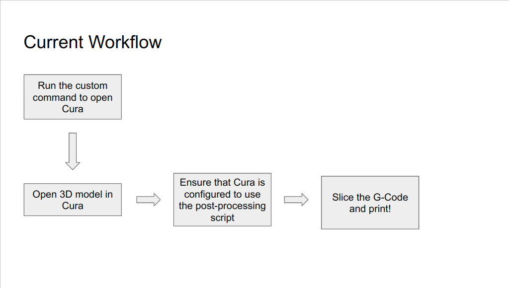
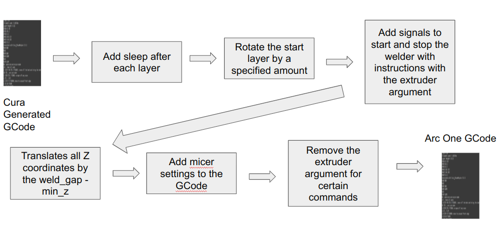

# Fall 2023 First Half Overview <!-- omit in toc -->

10/17/23

Joseph Chen

jxc1598@case.edu

The purpose of this document is to provide a broad overview of what the Software Team has accomplished in the first half of the Fall 2023 Semester.

## Table of Contents <!-- omit in toc -->

- [Background](#background)
- [How well did we meet our September deliverables?](#how-well-did-we-meet-our-september-deliverables)
  - [1. Cleanup Repository \& 2. Refactoring \& Unit Testing](#1-cleanup-repository--2-refactoring--unit-testing)
  - [3. New Shapes](#3-new-shapes)
  - [4. Linting \& CI](#4-linting--ci)
  - [5. Integration with Temperature Sensor](#5-integration-with-temperature-sensor)
- [Second Half of Semester Deliverables](#second-half-of-semester-deliverables)
  - [1. Integrate Temperature Sensor](#1-integrate-temperature-sensor)
  - [2. Talk with Team on Arc 2 Development](#2-talk-with-team-on-arc-2-development)
  - [3. `ArcPlugin` and Current Post-Processing Scripts](#3-arcplugin-and-current-post-processing-scripts)

## Background

**Key Problem:** Need a Cura GCode post-processing pipeline that makes the Cura GCode work for the Arc One WAAM machine

**Approach:** Cura Post-Processing Plugin + Custom Cura Post-Processing Scripts

The benefits of this approach are that the printing user experience is very smooth. The only difference is ensuring that our Cura script is enabled and that the parameters are correct. We avoid the pain of having to run the custom command by just having it opened by default, which is normal for our team.



The figure above displays the current workflow. The biggest pain point with the current approach is that we need to run a custom command to open Cura to make it possible to import our framework into the post-processing script.

This is a problem that I'm experimenting with trying to fix.

1. Hard-code the G-Code package path in the `cura` command:

   ```bash
   GCODE_REPO_DIR=${GCODE_REPO_DIR} ${ULTIMAKER_EXE}
   ```

   - The `GCODE_REPO_DIR` could be hard-coded, but that would make our post-processing script less extensible and less distributable.
   - Another approach to "hard-code" the package path is to create a **ONE-TIME** install script that:
     1. Creates symlinks in the `scripts` directory, so that the entire repository is now in the `scripts` directory.
     2. Use the Python `__file__` string to append the `arcgcode` package in the repository to the `sys.path`
     3. Import!
     4. See https://github.com/Arc-One-CWRU/gcode-parser/pull/17/files#diff-3a103ca8dc5d37bf3e56cd220bf4e58f17d9b82cb1c5606b242559961c567cdf as an example.

2. Build a custom G-Code plugin that can replace the default Cura `PostProcessingPlugin`.
   1. This is a path that I'm still exploring and prototyping to see if it is possible and reasonable to accomplish within the current time constraints.

## How well did we meet our September deliverables?

### 1. Cleanup Repository & 2. Refactoring & Unit Testing

I removed all of the outdated files and ported over the existing `Micer` to the new pipeline.

Henry unit-tested all of the components and integrated realistic GCodes for the old `Micer`. I unit-tested the new components (the `CuraPostProcessor`) with realistic GCodes. The new converted components are:

1. `ExtruderRemover`: replaces `remove_extruder` in the old processor
2. `AddSleep`: replaces `add_sleep` in the old processor
3. `AddMicerSettings`: replaces `add_micer_settings` in the old processor
4. `RotateStartLayerPrint`: replaces `rotate_start_layer_print` in the old processor
5. `MoveUpZ`: replaces `move_up_z` in the old processor
6. `AllWelderControl`: replaces `all_welder_control` in the old processor

These are all executed in sequential order in `CuraPostProcessor` through `CuraGCodePipeline` to post-process the generated Cura GCode.

As of 10/17, the order is:



However, these operations should be independent of order, which means that if we execute them in a different order, the result should be the same.

Henry also fixed the issue with sleep not being properly added after each layer. I need to integrate this bug fix into the `AddSleep` section processor.

One of the key improvements that I pushed for was to make it possible to import an existing module into a Cura script. The original approach was to just have all of the code in one file in the `RawMicerScript`. However, the issue with this approach is that it made testing much more difficult because you could not easily modularize and unit-test specific functions. Furthermore, there are several packages in the Cura script that are imported, but cannot be imported in a development environment because they are only included in the raw Cura build.

I prototyped the Unix version and worked with Henry to develop a working Windows version.

### 3. New Shapes

We've printed metal donuts and they look pretty good!

We also have planned to print shapes where there's a mix of curved lines and straight lines.

This will be done this week! Our plan is to:

1. Create a custom model or look for complex enough model on Thingiverse
2. Print it (and do some debugging based on the results)!

### 4. Linting & CI

We never got to this. If we continue to work on the `ArcPlugin`, this could be a higher value venue to explore because we would need to distribute the plugin through a GitHub release, but currently, the plugin itself is not a super high priority.

### 5. Integration with Temperature Sensor

Still waiting on the temperature sensor team before implementing the designed approach:

> Replace sleep with GCode command for wait to temperature.

## Second Half of Semester Deliverables

### 1. Integrate Temperature Sensor

### 2. Talk with Team on Arc 2 Development

We need to investigate how we can incorporate Cura G-Codes into the Arc 2 pipeline. We're still waiting on the Arc 2 team before we can proceed.

### 3. `ArcPlugin` and Current Post-Processing Scripts

While we are blocked, we will continue to test and fix bugs by testing prints with more complex shapes and settings.

One of the key initiatives that we are investigating is creating an actual Cura plugin and distributing it for WAAM post-processing on the Cura marketplace. The advantages are that an official plugin is easier to setup and install than the current approach for non-programmers. The disadvantages is that developing an actual plugin is much more complex than developing post-processing scripts for the Cura `PostProcessingPlugin`.
