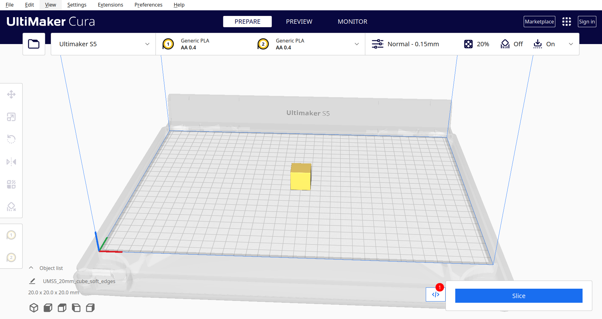
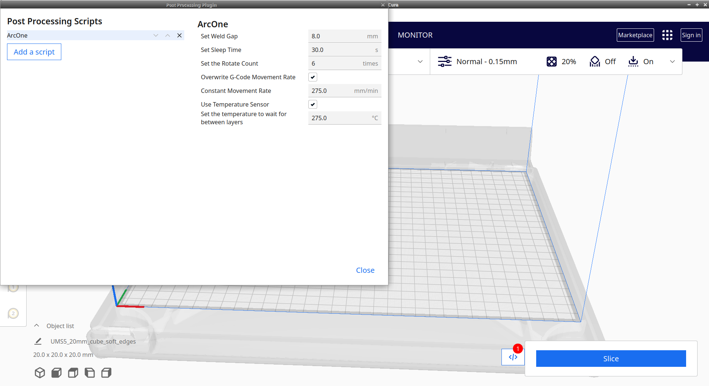
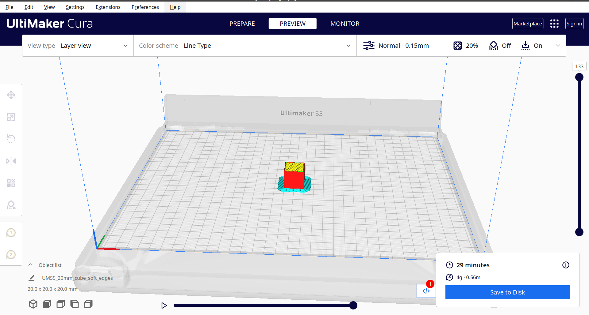
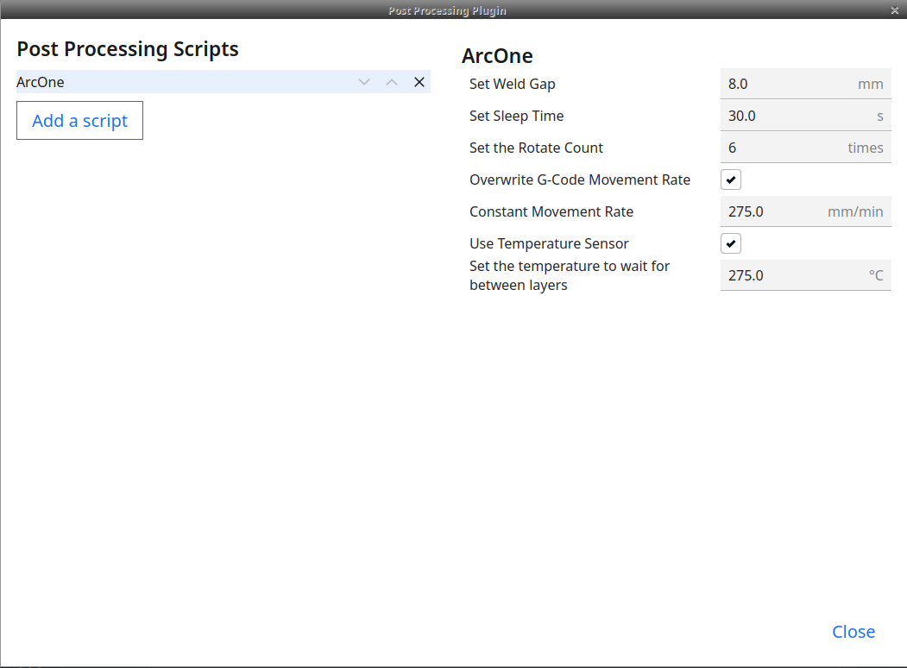
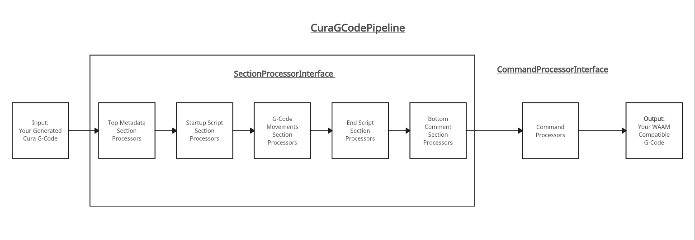

# Arc One Software Team Paper <!-- omit in toc -->

This document is intended to be read by both the software and engineering teams. It provides key information on the design philosophy, implementation, tradeoffs, limitations, and key workflows of `arcgcode` and the Arc One printer.

This document should provide Vishnu the necessary information to write a comprehensive paper and focuses heavily on the implementation and methodology instead of the background.

## Table of Contents <!-- omit in toc -->

- [Introduction](#introduction)
- [`ArcOne`](#arcone)
  - [Script Installation](#script-installation)
- [`arcgcode`](#arcgcode)
  - [Concepts Overview](#concepts-overview)
  - [Cura G-Code Sections](#cura-g-code-sections)
    - [Top Comment Section](#top-comment-section)
    - [Startup Script Section](#startup-script-section)
    - [G-Code Movements Section](#g-code-movements-section)
    - [End Script Section](#end-script-section)
    - [Bottom Comment Section](#bottom-comment-section)
  - [Create Your Own `CuraGCodePipeline`](#create-your-own-curagcodepipeline)
    - [Implementing a Custom Section Processor](#implementing-a-custom-section-processor)
    - [Implementing a Custom Command Processor](#implementing-a-custom-command-processor)
    - [Integrate New Custom Processors](#integrate-new-custom-processors)
  - [Implemented Processors](#implemented-processors)
- [Command Line Interface](#command-line-interface)
  - [`gcode` command](#gcode-command)
  - [`time`](#time)
- [Adding New Settings to `ArcOne`](#adding-new-settings-to-arcone)

## Introduction

The Arc One WAAM machine's controller is a Duet3D board. This board is able to translate G-Code instructions into actual movements, extrusion, temperature sensing, etc. The board does this when the team uploads a G-Code file to the board and starts a print through the Duet3D board web interface.

One of the software team's key problems we solved is creating G-Code files that work with the Arc One WAAM machine. We did this by utilizing Ultimaker Cura's slicing engine and creating and integrating a customizable post-processing script into Cura's Post Processing Plugin module. This solution allows the team to generate a WAAM-compatible G-Code from a 3D model through an easy-to-use user interface.

The full workflow looks like:

1. Upload a 3D model to Cura (i.e. a `.stl` file).
   
2. Customize print parameters in Cura through the `ArcOne` post-processing script dialog.
   
3. When pressing the "Slice" button, Cura uses its slicing engine to generate an initial G-Code and then post-processes that G-Code using the enabled post-processing scripts, such as our `ArcOne` post-processing script.
4. Afterwards, one can download the G-Code or upload it directly to the Duet3D board for use.
   
   - Clicking "Save to Disk" will allow you to save the G-Code file. If your computer is connected to the Duet3D board via an ethernet, you will see an option to "Upload" to the board.

In the following sections, I will take a **top-down approach** to describe more in-depth details of the implementation of the `ArcOne` post-processing script.

## `ArcOne`

As previously mentioned, the `ArcOne` post-processing script is how we ensure that G-Codes generated by Cura work for the Arc One machine. Once properly installed, this post-processing script is automatically run during the Cura "Slice" operation through Cura's native Post Processing Plugin module. By having this integration, the team can easily run the necessary post-processing procedures with no pre-requisite programming knowledge.

Likwise, Cura provides a user interface to customize paramters for installed post-processing scripts, such as our `ArcOne` script, if configured properly. Again, this feature makes using our solution easy for non-software team members and gives them the flexibility to quickly run different experiments. You can see an example of this user interface below:



Currently, we support the following parameters:

- **Weld Gap (mm):** the relative distance from printing surface. This is a necessary parameter to ensure that there is enough space to generate an arc to weld with.
- **Sleep Time (s):** the sleep time after each layer. This is a necessary paramter to allow the welded metal to cool in-between layers.
- **Rotate Count:** The number of rotations throughout the print. This paramter makes it so that the weld gun doesn't start at the same exact spot every single layer, which boosts the quality of the print.
- **Constant Movement Rate (mm/min):** the feed rate of the weld gun (a.k.a. the movement rate). This describes how fast the weld gun moves. This is a nice parameter to test different speeds.
- **Temperature to wait for between layers:** The interpass temperature to wait for. This parameter is still currently being tested and is not ready for production use.

The `ArcOne` post-processing script was implemented using Python 3.11.4 using Ultimaker Cura's native modules (`UM` and `..Script`). We were not able to install them locally, but those modules were properly imported when the post-processing script was run in Cura. The reason is that Cura has its own built-in Python executable and Python packages, such as `UM`. You can find the full implementation of the `ArcOne` post-processing script at: https://github.com/Arc-One-CWRU/gcode-parser/blob/main/plugins/ArcOne.py. The aforementioned settings are configured through the `getSettingDataString` method and are parsed through the `get_settings` method.

Our `ArcOne` script follows a couple key guidelines to properly implement a Cura post-processing script, such as:

1. Is a class that inherits `Script`
2. Implements a `getSettingDataString` method that returns a valid settings JSON string with the class name as the `name` and `key`.
3. Implements an `execute` method that ingests a `list[str]` of G-Code commands and returns a `list[str]` of post-processed G-Code commands. This is the key method where we call all of the WAAM G-Code post-processing operations. For quicker testing and modularity, we abstracted this behavior in our `arcgcode` Python package. Following sections will describe this package in more detail.

In our `execute` method, we ensure to catch all errors and print them out to the resulting G-Code with corresponding context. This prevents odd behavior where Cura silenty errors out and defaults to an older version of the post-processing script.

### Script Installation

Installing the `ArcOne` script deserves its own section due to the nuances of the Cura post-processing script installation process. As previously mentioned, we rely on Cura's native Post Processing Plugin to run the `ArcOne` post-processing script. This plugin module reads Python scripts that properly implement the `Scripts` class from the configuration scripts directory. For example, on Linux, that directory is `~/.local/share/cura/5.3/scripts`. You can get the Cura scripts directory through `Cura > Help > Show configuration folder`.

For simple scripts, as long as they are in the configuration scripts directory, Cura will automatically detect them and display them as options through the user interface (in Cura `Extensions > Post Processing > Modify G-Code > Add Script`). Likewise, you could simply overwrite the older version of the script with a newer version and restart Cura to use the new version of the script. A good example of this is our old `RawMicer` post-processing script (https://github.com/Arc-One-CWRU/gcode-parser/blob/main/plugins/RawMicer.py).

However, this is not enough for our use-case. We moved our post-processing code to a separate Python module `arcgcode` and imported `arcgcode` in our `ArcOne` post-processing script. As previously stated, this was to increase the testability, modularity, and extensibility of our post-processing code. In normal Python, you would install `arcgcode` through `pip3 install -r requirements.txt && pip3 install -e .`. Then would would simply import it in a Python script with something like `import arcgcode`.

However, that workflow does not work for a Cura post-processing script because UltiMaker Cura has its own built-in Python executable! That means that it does **not** use the same Python executable and packages as the one you have installed on your system or virtual environment! Therefore, if you installed `arcgcode` with `pip3`, it would only install it for your local Python installation, not the Cura one.

We circumvented this issue by:

1. Copying the post-processing scripts and `arcgcode` src directory to the configuration scripts directory
2. Adding the `arcgcode` package path to the Cura Python's `sys.path` in the post-processing scripts.

In Python, `sys.path` is a list of paths to directories that contain Python packages. Therefore, by adding the path to the copied repository + "src" to `sys.path` in a Cura post-processing script, we're able to `import arcgcode` successfully!

For example, in [`plugins/ArcOne.py`](../plugins/ArcOne.py), we call:

```python
    import os
    import json
    import sys
    import pathlib
    from importlib.machinery import SourceFileLoader
    # Assumes that the ArcOne is in the same directory as the repository
    src_dir = os.path.abspath(os.path.join(pathlib.Path(__file__).parent,
                                           "./src"))
    if not os.path.isdir(src_dir):
        raise Exception(f"could not find src directory: {src_dir}")

    if src_dir not in sys.path:
        sys.path.insert(0, src_dir)

    import arcgcode
    raw_import_path = os.path.join(src_dir, "arcgcode", "__init__.py")
    raw_arcgcode = SourceFileLoader("arcgcode", raw_import_path).load_module()

    from arcgcode import v1
    ...
```

`os.path.abspath(os.path.join(pathlib.Path(__file__).parent,"./src"))` looks like magic, but in essence, all it does is:

1. Look for the path to the plugins file (i.e. `~/.local/share/cura/5.3/scripts/ArcOne.py`)
2. Get the parent directory (`~/.local/share/cura/5.3/scripts`)
3. Add the absolute path of that parent directory + "src" to the `sys.path` through `sys.path.insert`.
   1. i.e. Add `~/.local/share/cura/5.3/scripts/src` to the `sys.path`
   2. **Note:** `src` refers to the same `src` that contains the `arcgcode` folder in this repository!

This lets Cura's Python discover the `arcgcode` package in `src` and import it properly to utilize all of the utilities in `arcgcode`!

We also added an additional `SourceFileLoader(...).load_module()` call to force the plugin to import the full `arcgcode` package and its sub-packages. This additional call was necessary because we found that Cura would sometimes only import the top-level `arcgcode` packages and completely omit the vital `arcgcode` sub-packages.

A downside with this installation approach is that everytime you want to make a change, you would need to re-run the `install.py` script as described in the official [README.md](../README.md).

Now, at this point, you should understand the high-level use-cases of this repository and how we integrate well with Cura. In the next sections, I will dive deeper and describe how the `arcgcode` does the G-Code post-processing and how to use it.

## `arcgcode`

`arcgcode` is a Python library designed for post-processing G-Codes for Wire Arc Additive Manufacturing (WAAM) machines. The library provides reusable components that you can use to build your own custom pipelines quickly.

### Concepts Overview

The goal of the components in this package is to take a G-Code file as input, do some sort of pre-defined modular transforms on the G-Code, and produce an output G-Code that works with a WAAM machine.

The key building blocks to make that possible are:

1. `SectionProcessorInterface`: Takes in one of the five pre-defined sections of a G-Code and processes it by returning a list of G-Code commands.
2. `CommandProcessorInterface`: Takes in a G-Code command and returns a resulting transformed command.
3. `CuraGCodePipeline`: Splits the input G-Code file into different sections and runs both the `SectionProcessorInterface` classes and the `CommandProcessorInterface` classes in succession.

You can see the general workflow below:



**Figure 1. Overview of the processors executed in `CuraGCodePipeline.process`**

Our `ArcOne` post-processing script calls `CuraPostProcessor.execute`, which is essentially a thin wrapper around `CuraGCodePipeline`.

### Cura G-Code Sections

As you can see in **Figure 1**, there are multiple different types of section processors. Each of these sections is represented the `GCodeSection` enum, which looks like:

```python
class GCodeSection(str, Enum):
    TOP_COMMENT_SECTION = "TOP_COMMENT"
    STARTUP_SCRIPT_SECTION = "STARTUP_SCRIPT"
    GCODE_MOVEMENTS_SECTION = "GCODE_MOVEMENTS"
    END_SCRIPT_SECTION = "END_SCRIPT"
    BOTTOM_COMMENT = "BOTTOM_COMMENT"
```

All sections in `GCodeSection` are in **chronological order** from top to bottom. This means that a G-Code is structured as:

1. A top comment
2. A startup script
3. G-Code movements
4. An end script
5. A bottom comment

In the following documentation, we will describe what each section looks like and how we split the sections up in G-Codes in a general manner.

#### Top Comment Section

The `TOP_COMMENT_SECTION` represents the top comment section in a Cura G-Code file. All comments in G-Code files start with a `;` character. An example of a `TOP_COMMENT_SECTION` is:

```
;FLAVOR:Marlin
;TIME:66
;Filament used: 0.00563198m
;Layer height: 1
;MINX:312.526
;MINY:120
;MINZ:0.3
;MAXX:342.474
;MAXY:120
;MAXZ:0.3
;Exported with Cura-DuetRRF v1.2.9 plugin by Thomas Kriechbaumer
....
; thumbnail_QOI end
;Generated with Cura_SteamEngine 5.3.0
```

A `TOP_COMMENT_SECTION` typically ends with a comment that starts with `;Generated with` (`END_OF_TOP_METADATA`) and we use that as the criteria for when it should be sliced.

#### Startup Script Section

The `STARTUP_SCRIPT_SECTION` occurs right after the `TOP_COMMENT_SECTION`. It represents the start up script for the 3D printer or WAAM machine, which typically consists of sanity checks and calibration.

For instance, this may look like:

```
M105
M109 S0
M82 ;absolute extrusion mode
G28 ;Home
;G1 Z15.0 F6000 ;Move the platform down 15mm
;Prime the extruder
;G92 E0
;G1 F200 E3
;G92 E0
;M42 P1 S1
G92 E0
G92 E0
;LAYER_COUNT:2
```

The end of the startup script is when the G-Code movements start running which is represented by `";LAYER_COUNT:"` (`END_OF_STARTUP_SCRIPT`).

#### G-Code Movements Section

The `GCODE_MOVEMENTS_SECTION` represents the commands that run the actual printing (movements, sleep, wait until temperature, extruder control, etc.). This section is characterized by layers (represented by the `;LAYER` comment) and different types of layers. You can see the [`ExcludeMeshLayer`](../src/arcgcode//processor/section/exclude_mesh.py) section processor as an example of how a layer type can be detected and manipulated.

A very simple example of a `GCODE_MOVEMENTS_SECTION` looks like:

```
;LAYER_COUNT:2
;LAYER:0
M107
;MESH:WeldingLineTest.STL
G0 F600 X342.474 Y120 Z0.3
;TYPE:WALL-OUTER
G1 F60 X312.526 Y120 E5.63198
;TIME_ELAPSED:66.230551
```

A `GCODE_MOVEMENTS_SECTION` ends when the `;TIME_ELAPSED` (`END_OF_GCODE_MOVEMENTS`) shows up.

#### End Script Section

Just like how each G-Code has a startup script, each one has an end script, which consists of cleanup and sanity checks like turning the extruder off. The end script occurs **right after** the G-Code movements are done.

An example `END_SCRIPT_SECTION` looks like:

```
;M104 S0
;M140 S0
;Retract the filament
;G92 E1
;G1 E-1 F300
;G28 X0 Y0
;M84
M42 P1 S0
G4 S5
G28
M82 ;absolute extrusion mode
;End of Gcode
```

The end script ends when the comment `;End of Gcode` (`END_OF_GCODE`) is specified.

#### Bottom Comment Section

The `BOTTOM_COMMENT` is whatever is left **after** the end script, which is typically a comment, such as:

```
;SETTING_3 {"global_quality": "[general]\\nversion = 4\\nname = Arc One #2\\ndef
;SETTING_3 inition = custom\\n\\n[metadata]\\ntype = quality_changes\\nquality_t
;SETTING_3 ype = extra coarse\\nsetting_version = 21\\n\\n[values]\\nadhesion_ty
;SETTING_3 pe = none\\nlayer_height = 1\\n\\n", "extruder_quality": ["[general]\
;SETTING_3 \nversion = 4\\nname = Arc One #2\\ndefinition = custom\\n\\n[metadat
;SETTING_3 a]\\ntype = quality_changes\\nquality_type = extra coarse\\nintent_ca
;SETTING_3 tegory = default\\nposition = 0\\nsetting_version = 21\\n\\n[values]\
;SETTING_3 \ncool_fan_enabled = False\\nmaterial_print_temperature = 0\\nretract
;SETTING_3 ion_enable = False\\nspeed_print = 2\\nspeed_travel = 20\\nwall_thick
;SETTING_3 ness = 1\\n\\n"]}
```

### Create Your Own `CuraGCodePipeline`

As previously mentioned, the `CuraGCodePipeline` is the core class that actually links the processors and runs the G-Code post-processing.

An example of how it is used is done in [`CuraPostProcessor`](../src/arcgcode/v1/postprocessor.py):

```python
        gcode_pipeline = CuraGCodePipeline(
            section_processors=[
                AddSleep(sleep_time=self.settings.sleep_time),
                RotateStartLayerPrint(self.settings.rotate_amount),
                AllWelderControl(), MoveUpZ(self.settings.weld_gap),
                AddMicerSettings(settings=self.settings),
            ],
            command_processor=[ExtruderRemover()])
        new_gcode = gcode_pipeline.process(data)
```

It takes in a G-Code file that is split into a list of strings and calls `CuraGCodePipeline.process` to generate the new G-Code. All of the classes specified for `section_processors` implement the `SectionProcessorInterface` interface and all of the classes specified for `command_processors` implement the `CommandProcessorInterface` interface.

By choosing to abstract the data processing in an interface with functions, the actual class initialization signature and class properties can vary depending on the desired operation, which makes the processors easy to create!

Likewise, you can easily customize your own pipeline by adding or removing section processors or command processors.

In the following sections, we will cover how to create your own custom processors and use them!

#### Implementing a Custom Section Processor

All of the processors are classes that implement either `SectionProcessorInterface` or `CommandProcessorInterface`.

To implement `SectionProcessorInterface`, you need to create a class that has the methods `process(self, gcode_section: list[str]) -> list[str]` and `section_type(self) -> GCodeSection`. A minimal section processor for the G-Code Movements Section would look like:

```python
class HelloWorldSectionProcessor(SectionProcessorInterface):
    """Prints Hello World while processing :)
    """

    def __init__(self) -> None:
        super().__init__()

    def process(self, gcode_section: list[str]) -> list[str]:
        """Prints Hello World while processing :)
        """
        print("Hello World!")
        # TODO: Normally you would just iterate through the
        # gcode_section and create a new list of G-Code command
        # strings. The resulting list of strings DOES NOT
        # need to be the same length as the input.
        return gcode_section

    def section_type(self) -> GCodeSection:
        """Returns the current section type.
        """
        return GCodeSection.GCODE_MOVEMENTS_SECTION
```

A realistic example of a section processor used by the Arc Research team as of 10/21 is `AddMicerSettings`.

```python
class AddMicerSettings(SectionProcessorInterface):
    """Adds the micer settings to GCode file.
    """

    def __init__(self, settings: CuraMicerSettings) -> None:
        super().__init__()
        self.settings = settings

    def process(self, gcode_section: list[str]) -> list[str]:
        """Reads the G-Code file buffer and does an action. It should return
        the desired G-Code string for that section.
        """
        new_gcode_section: list[str] = []
        for instruction in gcode_section:
            GENERATED_STRING = ";Generated with Cura_SteamEngine 5.4.0"
            if instruction.startswith(GENERATED_STRING):
                new_gcode_section.append(f"{GENERATED_STRING} + Micer\n")
            elif instruction.startswith(";MAXZ:"):
                new_gcode_section.append(instruction + "\n;Micer Settings\n")
                # Iterate over the attributes of the dataclass
                for field in fields(self.settings):
                    settings_attr = field.name
                    settings_val = getattr(self.settings, settings_attr)
                    parsed_settings = f';{settings_attr} = {settings_val}\n'
                    new_gcode_section.append(parsed_settings)
            else:
                new_gcode_section.append(instruction)

        return new_gcode_section

    def section_type(self) -> GCodeSection:
        """Returns the current section type.
        """
        return GCodeSection.GCODE_MOVEMENTS_SECTION
```

As you can see, `AddMicerSettings` just implements the two required methods. Anything else including the `__init__` function signature is flexible.

#### Implementing a Custom Command Processor

`CommandProcessorInterface` is a bit simpler. To implement this interface, create a class that has the `process(self, gcode_instruction: str) -> str` method. A minimal command processor would look like:

```python
class HelloWorldCommandProcessor(CommandProcessorInterface):
    def __init__(self) -> None:
        super().__init__()

    def process(self, gcode_instruction: str) -> str:
        """Prints Hello World when processing each G-Code command!
        """
        print("Hello World!")
        # TODO: Do some manipulation with the gcode_instruction
        # which could look like G1 E..., or G92 E0, etc.
        return gcode_instruction
```

An example we currently use is `ExtruderRemover`:

```python
class ExtruderRemover(CommandProcessorInterface):
    """Removes the extruder argument in commands that have Xnnn, Ynnn, Znnn,
    Ennn as arguments.

    These commands include but are not limited to:
    G0, G1, G2, G3, G92, M566
    """

    def __init__(self) -> None:
        super().__init__()
        self.extruder_g1_matcher = re.compile(
            r"([E][-+]?([0-9]*\.[0-9]*|[0-9]*))\w+")

    def should_skip(self, gcode_instruction: str) -> bool:
        """Checks if the given G-Code instruction should be skipped.

        Args:
            gcode_instruction (str): The G-Code instruction to check.

        Returns:
            bool: True if the instruction should be skipped.
        """

        skip_line = "X" not in gcode_instruction and \
            "Y" not in gcode_instruction and \
            "Z" not in gcode_instruction and " E" in gcode_instruction

        return skip_line

    def process(self, gcode_instruction: str) -> str:
        """Matches a G-Code instruction. It should return
        the desired G-Code string for that line.
        """
        if self.should_skip(gcode_instruction):
            return gcode_instruction

        # Remove all extruder instructions in G1 commands
        new_g1 = self.extruder_g1_matcher.sub("", gcode_instruction)
        return new_g1
```

In the above example, `ExtruderRemover.should_skip` is not required to implement the `CommandProcessorInterface`, but it serves as a useful utility function to abstract some of the logic for `ExtruderRemover.process`.

#### Integrate New Custom Processors

Once you've created a custom processor (either a section or command processor), simply add it to the list in [`CuraPostProcessor`](../src/arcgcode/v1/postprocessor.py)'s `CuraGCodePipeline` initialization:

```python
        gcode_pipeline = CuraGCodePipeline(
            section_processors=[
                # INSERT HERE:
                HelloWorldSectionProcessor(),
                AddSleep(sleep_time=self.settings.sleep_time),
                RotateStartLayerPrint(self.settings.rotate_amount),
                AllWelderControl(), MoveUpZ(self.settings.weld_gap),
                AddMicerSettings(settings=self.settings),
            ],
            command_processor=[
                # OR HERE
                HelloWorldCommandProcessor(),
                ExtruderRemover()
            ])
        new_gcode = gcode_pipeline.process(data)
```

### Implemented Processors

TODO: briefly explain the use of each implemented processor in:

```python
        section_processors: list[SectionProcessorInterface] =[
                AddSleep(sleep_time=self.settings.sleep_time),
                RotateStartLayerPrint(self.settings.rotate_amount),
                AllWelderControl(),
                MoveUpZ(self.settings.weld_gap),
                AddMicerSettings(settings=self.settings),
                AddGcodeVersion(),
                ChangeInitialZ()
            ]
        command_processors: list[CommandProcessorInterface] = [
            ExtruderRemover()
        ]

        if self.settings.overwrite_movement_rate:
            processor = ChangeMovementRate(self.settings.movement_rate)
            command_processors.append(processor)

        if self.settings.use_temperature_sensor:
            processor = WaitForTemp()
            section_processors.append(processor)

        gcode_pipeline = CuraGCodePipeline(
            section_processors=section_processors,
            command_processor=command_processors)

        new_gcode = gcode_pipeline.process(data)
        return new_gcode
```

## Command Line Interface

We also implemented a simple command line interface (CLI) for quickly debugging G-Code post-processing and for running our custom print timer. This CLI is implemented in Python and uses the `typer` framework. `typer` makes creating essential CLI utilities, such as help strings and subcommands, easy and quick to implement.

### `gcode` command

This command processes the G-Code to a WAAM compatible format. This is a good backup just in-case the Cura post-processing script is not completely functional. You can generate a G-Code using Cura. Then call this command:

```bash
python cli.py gcode -i PATH_TO_CURA_GCODE -o output_gcodes -v
```

Make sure to replace `PATH_TO_CURA_GCODE` with the path to your generated Cura G-Code. This will generate the WAAM compatible G-Code inside of the output_gcodes directory relative to the current directory.

The available options are:

- `-i`: The path to an input directory of GCodes or the path to a G-Code file to transform. [required]
- `-o`: The path to the output directory where the parsed GCodes will be generated to [required]
- `-v`: Toggles on debug logging. [default: True]

### `time`

This command will automatically monitor the current print by polling the Duet3D board's [RepRap API](https://github.com/Duet3D/RepRapFirmware/wiki/HTTP-requests) and [REST API](https://github.com/Duet3D/DuetSoftwareFramework/wiki/REST-API) every 1/100th of a second. It will export key print timing information once prints finish.

This command is still being under active development.

## Adding New Settings to `ArcOne`

A key benefit to our approach is that adding new settings to our `ArcOne` post-processing script is not too cumbersome. The procedure would be to:

1. Create the corresponding processors to do the operation for the setting.
2. Add any new parameters to `CuraMicerSettings`.
3. Integrate the new processors into `CuraPostProcessor`.
4. Update the `ArcOne` post-processing script to display the new settings values on the Cura UI by:
   1. Add an options dictionary to the `options` in `getSettingDataString` representing the new Cura UI parameters. Please refer to the existing parameters as examples.
5. Run [`install.py`](https://github.com/Arc-One-CWRU/gcode-parser/blob/main/install.py) to update the post-processing script and Cura directory `arcgcode` package.
6. Restart Cura. Now, when you slice and generate the G-Code, it should display the new settings in the UI and run it with the proper processors.

Although this may seem like a lot of steps, the hardest part is definitely writing and testing the processors. Using our [CLI](https://github.com/Arc-One-CWRU/gcode-parser/blob/main/cli.py), you can quickly debug the post-processed G-Code generation without having to constantly restart Cura.
